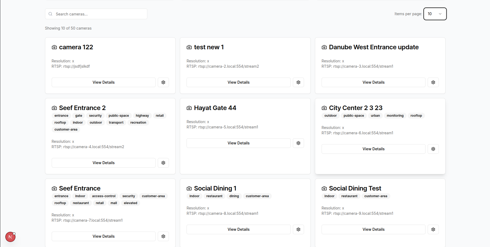
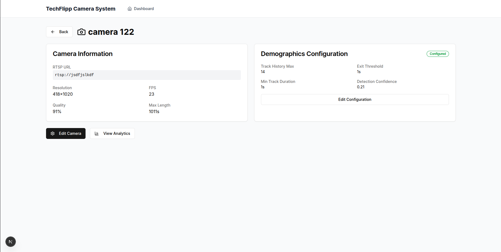
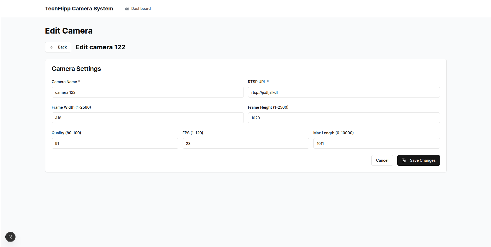
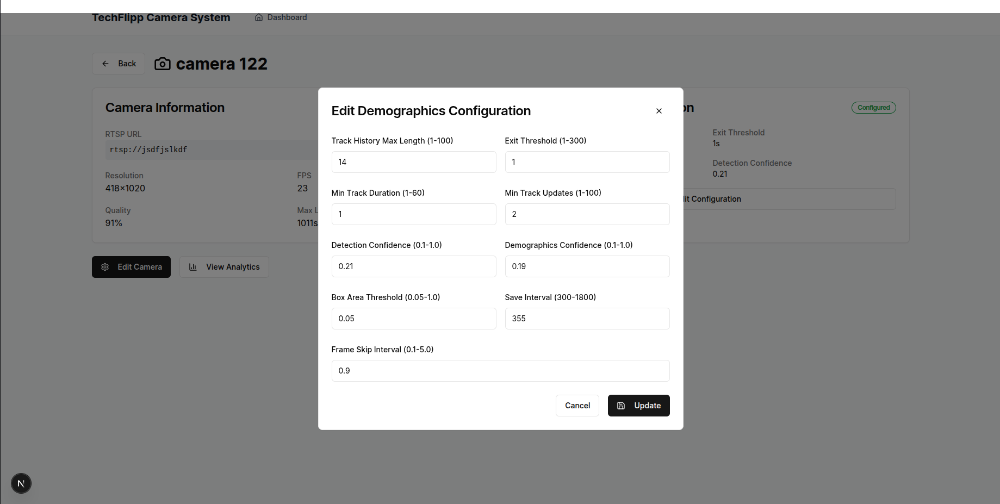
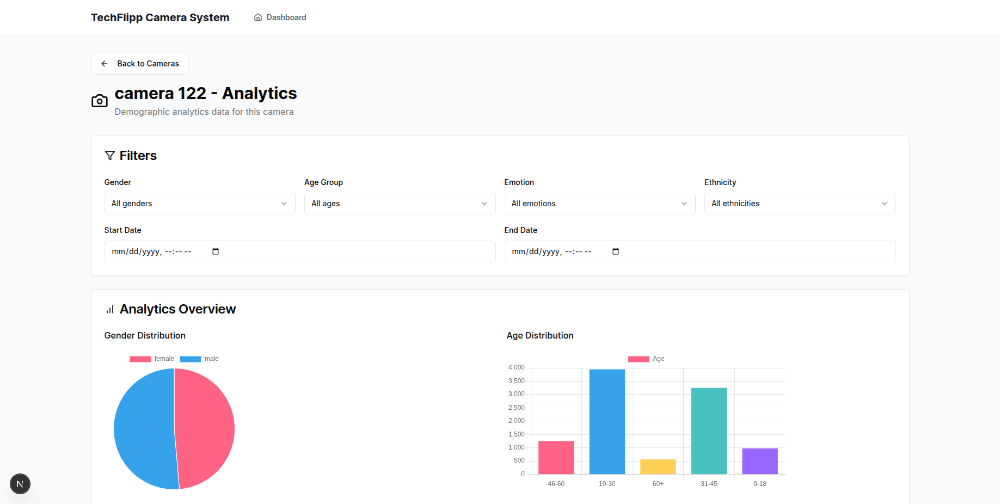
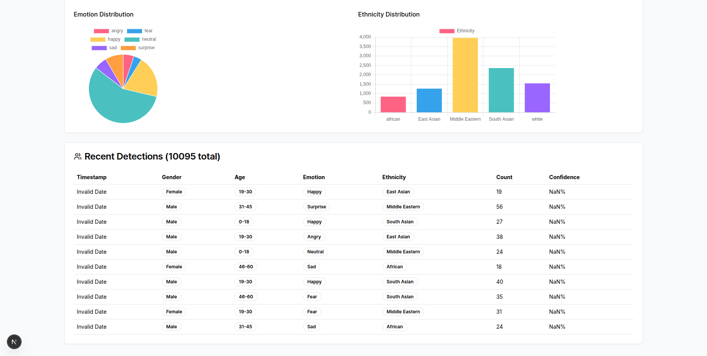

# TechFlipp Camera Management System

A comprehensive Next.js application for managing cameras and analyzing demographic data collected by surveillance systems.

## 🚀 Setup Instructions

### Prerequisites

- Node.js 18+
- npm or yarn package manager

### Installation

1. **Clone the repository**

```shellscript
git clone [your-forked-repo-url]
cd techflipp-camera-management
```

2. **Install dependencies**

```shellscript
npm install
# or
yarn install
```

3. **Run the development server**

```shellscript
npm run dev
# or
yarn dev
```

4. **Open your browser**
   Navigate to [http://localhost:3000](http://localhost:3000)

## 📋 Implementation Overview

### Architecture & Tech Stack

- **Framework**: Next.js 14 with App Router
- **Styling**: Tailwind CSS + shadcn/ui components
- **State Management**: React hooks with optimistic updates
- **API Integration**: Native fetch with comprehensive error handling
- **TypeScript**: Full type safety throughout the application

### Key Features Implemented

#### 1. **Camera Management System**

- **Dashboard**: Overview with key metrics and camera statistics
- **Camera List**: Paginated view with search functionality and customizable page sizes
- **Camera Details**: Comprehensive information display with demographics configuration status
- **Camera Editing**: Full CRUD operations with real-time validation

#### 2. **Demographics Analytics**

- **Dynamic Routing**: `/demographics/[cameraId]` for camera-specific analytics
- **Advanced Filtering**: Filter by gender, age, emotion, ethnicity, and date ranges
- **Data Visualizations**: Statistical breakdowns and interactive charts
- **Real-time Updates**: Live data fetching with loading states

#### 3. **Demographics Configuration**

- **Modal-based Forms**: Intuitive configuration creation and editing
- **Validation**: Comprehensive form validation with meaningful error messages
- **One-to-One Relationship**: Proper camera-config relationship management

## 🎯 Design Decisions & Assumptions

### Technical Decisions

1. **App Router over Pages Router**

1. Leveraged Next.js 14's App Router for better performance and developer experience
1. Server-side rendering for camera headers and metadata
1. Proper loading states and error boundaries

1. **Component Architecture**

1. Modular, reusable components following single responsibility principle
1. Proper separation of concerns between UI and business logic
1. Custom hooks for complex state management

1. **API Integration Strategy**

1. Centralized API client with consistent error handling
1. Graceful degradation when API is unavailable
1. Optimistic UI updates for better user experience

1. **Routing Strategy**

1. RESTful URL structure: `/demographics/[cameraId]`
1. Dynamic routing for better UX and SEO
1. Proper 404 handling for invalid resources

### UX/UI Decisions

1. **Responsive Design**

1. Mobile-first approach with Tailwind CSS
1. Adaptive layouts for all screen sizes
1. Touch-friendly interface elements

1. **Loading States**

1. Skeleton loaders for better perceived performance
1. Suspense boundaries for progressive loading
1. Meaningful loading indicators

1. **Error Handling**

1. User-friendly error messages
1. Graceful fallbacks for API failures
1. Error boundaries to prevent app crashes

### Assumptions Made

1. **API Behavior**

1. Tags can be either strings or objects with `{id, name, color}` structure
1. Demographics configuration has a one-to-one relationship with cameras
1. API responses follow the documented schema

1. **User Workflow**

1. Users primarily navigate from camera list to specific camera analytics
1. Demographics configuration is managed per camera
1. Real-time data updates are preferred over cached data

1. **Business Logic**

1. Only cameras with demographics configuration can show analytics
1. Pagination defaults to 20 items per page
1. Date filters are optional and use local datetime format

## 📱 Screenshots/Demo

### Dashboard Overview

1. Dashboard view with paginated lists of camera, search and page size



### Camera Management

1. Single Camera details with camera information and demographics configuration



2. Single Camera edit page



3. Edit configuration pop-up



### Demographics Analytics

1. Demographics Analytics for the single camera with filters




---
